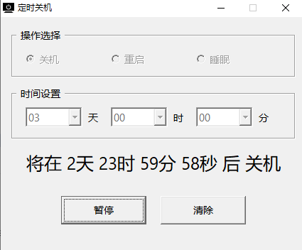

# Windows定时关机工具

一个简单的 Windows 定时关机工具，支持定时关机、重启和休眠功能。

## 功能特点

- 支持设置天、时、分的定时
- 支持关机、重启、休眠三种模式
- 支持最小化到系统托盘



## 使用方法

1. 选择需要的操作模式（关机/重启/休眠）
2. 设置定时时长（天/时/分）
3. 点击"确定"开始定时任务
4. 点击"清除"可以取消定时任务
5. 最小化时会自动隐藏到系统托盘
6. 退出程序会取消定时任务并退出

## 编译命令

```bash
## x64
windres resource.rc -o resource.o

gcc -g shutdown_tool.c resource.o -o ShutdownTool_x64.exe -mwindows -lcomctl32 -luser32 -lgdi32 -lshell32 -municode

## x86
i686-w64-mingw32-windres resource.rc -o resource.o

i686-w64-mingw32-gcc -g shutdown_tool.c resource.o -o ShutdownTool_x86.exe -mwindows -lcomctl32 -luser32 -lgdi32 -lshell32 -municode
```

## 下载链接

[蓝奏云](https://wwpr.lanzout.com/b00q0d37yf) 密码: `8jdk`

## 开源协议

MIT License